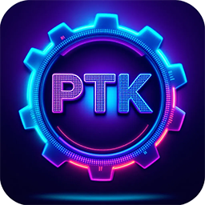

# PTK super easy mobile game sdk
## C++/OpenGL ES2/OpenAL/Freetype2

Your project will be buildable for Android, PC, Web, everywhere.
This game engine is open source and forever free. Please buy me a coffee is you like it!
Send your game name and I will add it in the powered by ptk list.

### Features

- [OpenGL ES2](https://www.khronos.org/opengles/)
- [GLFM](https://github.com/brackeen/glfm)
- [OpenAL](https://github.com/kcat/openal-soft)
- [Freetype2](https://github.com/freetype/freetype)
- [Box2D](https://www.google.com/search?q=github+Box2d&sourceid=chrome&ie=UTF-8)


## PTK is a very easy to use 2D engine for C++/OpenGL ES2 games.

- **KGraphic**: Blit super fast, alpha, zoom, rotation.
- **KInput**: Key and touch input.
- **KMusic**: Music player
- **KSound**: Sound management with OpenAL.

[](https://www.buymeacoffee.com/jmapp)


## Getting Started

1. Clone this repository:
```bash
git clone https://github.com/brizzly/ptk.git
```
2. include /iPTKSources into your project   

3. Example : xcode examples project in: /examples/Simple
- iOS Landscape
- iOS Portrait
- Android Portait

## Usage : 

- Load and display a sprite :
```bash
image = new KGraphic();
image->loadPicture("image.png");
image->blit(0, 0, 256, 256, 140, 80, a, z);
```

- Display lines :
```bash
shapeGraphic->drawLine(x, y, x2, y2, R, G, B, A, 1.0f);
```

- Load and play a sound or music :
```bash
sound1 = new KSound();
sound1->loadSample(KMiscTools::makeFilePath("boing2.caf"));
sound1->setVolume(50);

music1 = new KMusic();
music1->playMusic(KMiscTools::makeFilePath("menu.mp3"));
```

- Read inputs:
```bash
sFinger fingerPos = KInput::getFinger(0);

int hitX, hitY = 0;
if(KInput::isScreenPressed(&hitX, &hitY) == true) {

}
```


# Games prowered by PTK

## iPhone
- ULTRANIUM https://apps.apple.com/app/space-breakout-ultranium/id6736717749
- GRIZZLY https://apps.apple.com/app/grizzly-adventures-crazy-bear-platformer/id357410945
- BARNEY https://apps.apple.com/app/barney-adventures/id502135523
- METAL-ANGEL https://apps.apple.com/app/metal-angel-best-shootem-up/id287261924

## Android
coming-soon

## macOS
- GRIZZLY (macos) https://apps.apple.com/app/grizzly-retro-platformer/id413938360?mt=12
- ANDROID LODERUNNER (macos) https://apps.apple.com/app/android-best-retro-lode-runner/id412859612
- ANDROID2 (macos) https://apps.apple.com/app/android-2-retro-loderunner/id1347741576
- ANDROKIDS (macos) https://apps.apple.com/app/notebook-city-androkids/id1516357274
- BARNEY (macos) https://apps.apple.com/app/barney/id481853130
- ANDROKIDS2 (macos) https://apps.apple.com/app/androkids-2/id1516721499
- MARTY MCBLAST (macos) https://apps.apple.com/app/marty-mcblast/id870219886
- METAL-ANGEL (macos) https://apps.apple.com/app/metal-angel-shooter/id6544782954
- ULTRANIUM 3D (macos) https://apps.apple.com/app/ultranium3d/id413890023
- ULTRANIUM4 (macos) https://apps.apple.com/app/ultranium-4-breakout-shooter/id412207082
- ULTRANIUM5 (macos) https://apps.apple.com/app/ultranium-5-crazy-arcade-game/id431295311
- HALLOWEEN 3D (macos) https://apps.apple.com/app/halloween-3d/id1276055212

## PC
- GRIZZLY (pc) https://brizzlyy.itch.io/grizzly-adventures
- ANDROID LODERUNNER (pc) https://brizzlyy.itch.io/android-lode-runner
- ANDROID2 (pc) https://brizzlyy.itch.io/androkids2
- ANDROKIDS (pc) https://brizzlyy.itch.io/androkids
- BARNEY (pc) https://brizzlyy.itch.io/barney-adventures
- MARTY MCBLAST (pc) https://brizzlyy.itch.io/marty-mcblast
- METAL-ANGEL (pc) https://brizzlyy.itch.io/metal-angel-shoot-em-up
- ULTRANIUM4 (pc) https://brizzlyy.itch.io/ultranium-4
- ULTRANIUM5 (pc) https://brizzlyy.itch.io/ultranium-5


